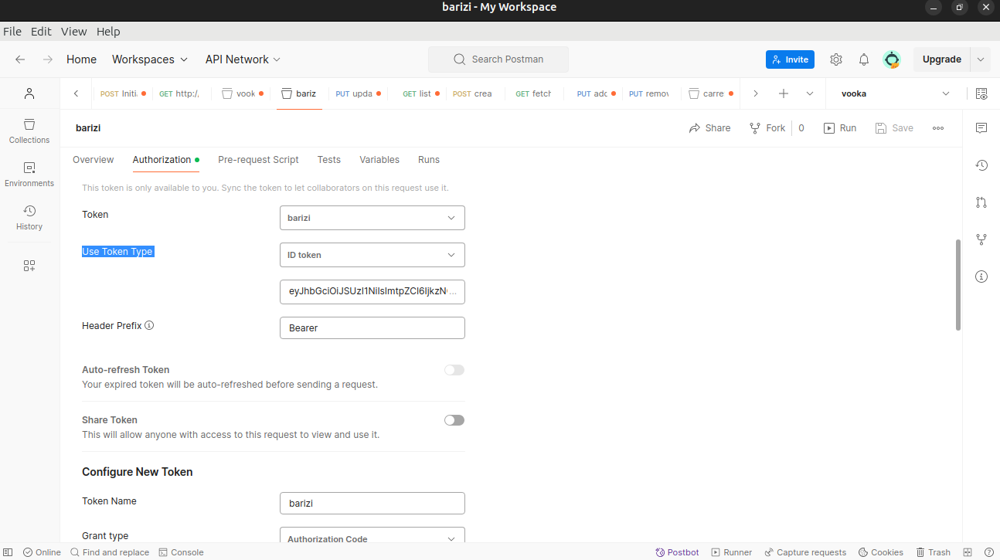
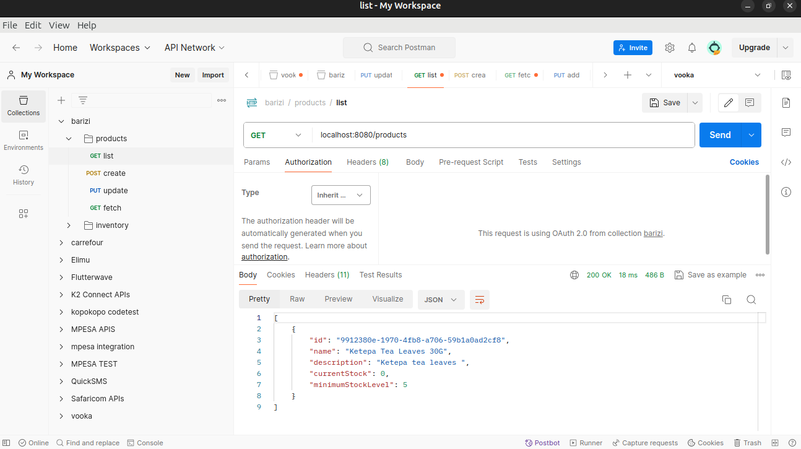
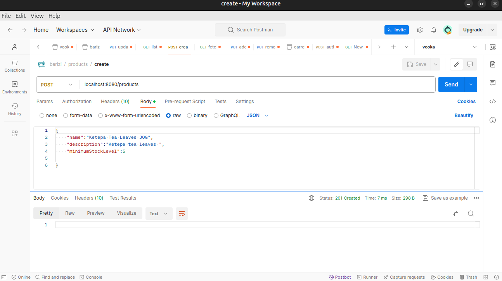
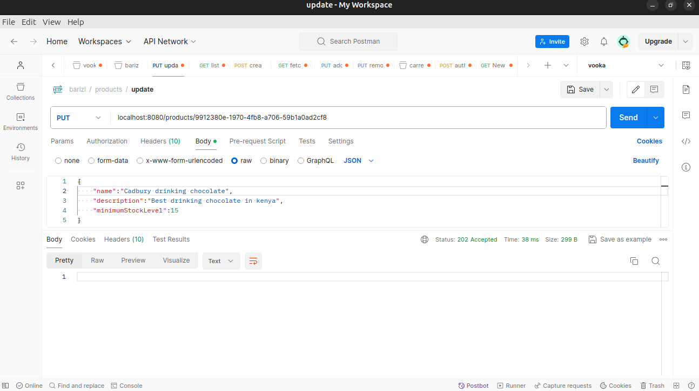
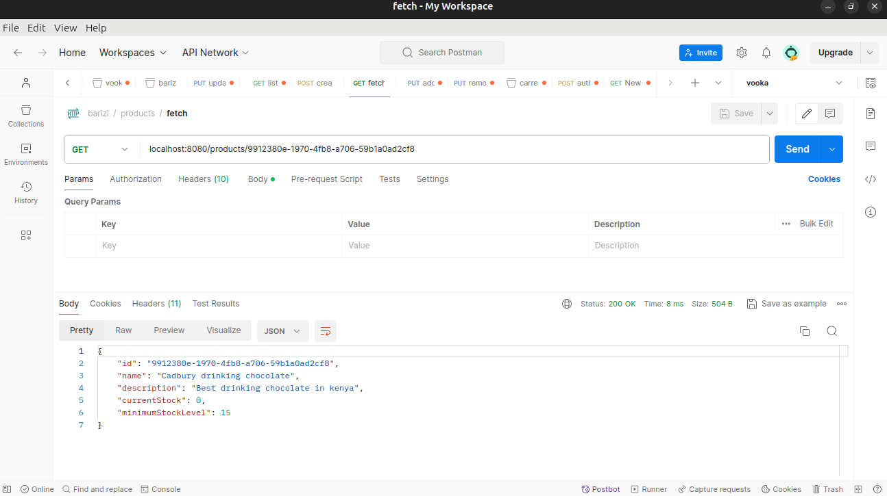

# springboot-sample-app


## Requirements

For building and running the application you need:

- [JDK 17](https://www.oracle.com/java/technologies/javase/jdk17-archive-downloads.html)
- [Maven 3](https://maven.apache.org)

## Running the application locally

There are several ways to run a Spring Boot application on your local machine. One way is to execute the `main` method in the `com.barizicommunications.barizi` class from your IDE.

Alternatively you can use the [Spring Boot Maven plugin](https://docs.spring.io/spring-boot/docs/current/reference/html/build-tool-plugins-maven-plugin.html) like so:

```shell
mvn spring-boot:run
```

### Database
This application uses a h2 in-memory database
### Design
This application is a simple RestApi service. The functionality includes CRUD operations to manage products
and an inventory service to manage stock levels.

### Security
The application uses oauth2 with Google as the identity service provider. I have set it up 
as a "resource server" using Google as an authorization server.

This can be tested on postman using the authorization tab, I have included a postman collection in this project.
Instructions on how to setup postman can be found at https://blog.postman.com/how-to-access-google-apis-using-oauth-in-postman/
````
Remember to change the token to id_token under Use Token Type on postman
````


### Testing
I have used the following tools to test my endpoints

* postman
* Junit5


### Endpoints
## List Products ``GET - /products``
#### Sample Response
```
[
    {
        "id": "9912380e-1970-4fb8-a706-59b1a0ad2cf8",
        "name": "Ketepa Tea Leaves 30G",
        "description": "Ketepa tea leaves ",
        "currentStock": 0,
        "minimumStockLevel": 5
    }
]

```



## Create Product ``POST - /products``
The expected response code is ``201 Created``
#### Sample Request
```
    {
     
        "name": "Ketepa Tea Leaves 30G",
        "description": "Ketepa tea leaves ",
        "minimumStockLevel": 5
    }
```


## Update Product ``PUT - /products/{id}``
The expected response code is ``202 Accepted``
#### Sample Request
```
    {
     
        "name": "Ketepa Tea Leaves 30G",
        "description": "Ketepa tea leaves ",
        "minimumStockLevel": 5
    }
```


## Fetch Product ``GET - /products/{id}``
The expected response code is ``200 Ok``
#### Sample Response
```
    {
        "id": "9912380e-1970-4fb8-a706-59b1a0ad2cf8",
        "name": "Ketepa Tea Leaves 30G",
        "description": "Ketepa tea leaves ",
        "currentStock": 0,
        "minimumStockLevel": 5
    }
```

